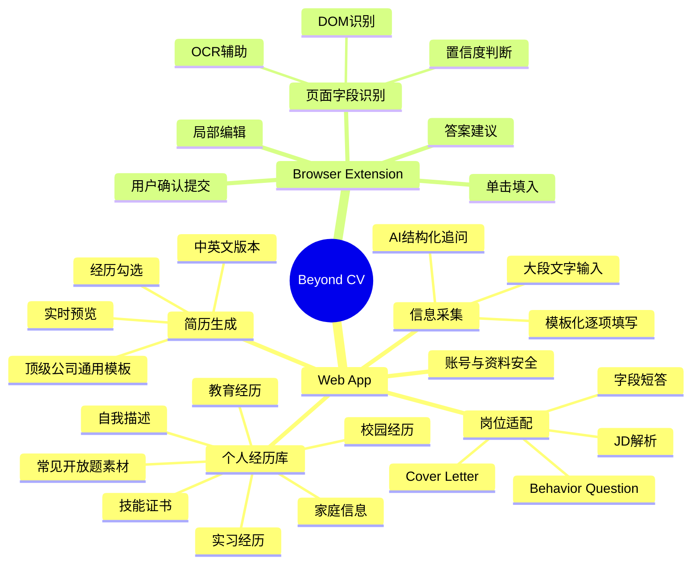
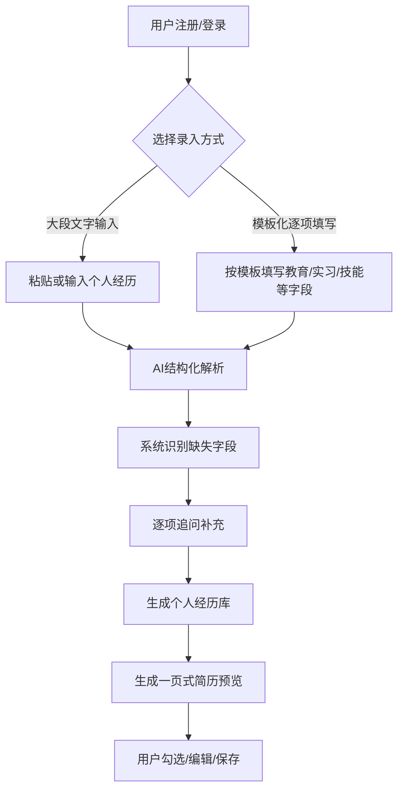
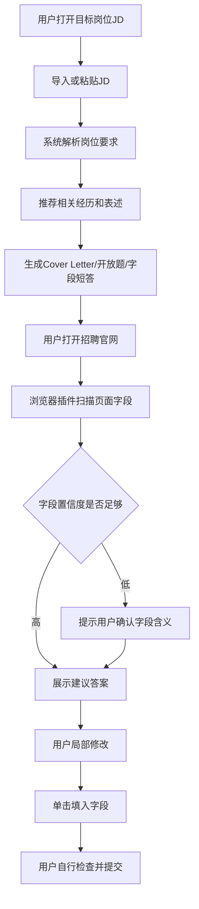

# Beyond CV 产品需求文档 (PRD)

## 1. 文档信息

| 字段 | 内容 |
|-----|------|
| 产品名称 | Beyond CV |
| 文档版本 | V1.0 |
| 编写日期 | 2026-05-12 |
| 编写人 | Varian / Codex |
| 最后更新 | 2026-05-12 |
| 文档范围 | MVP：C 端求职者的个人经历库、简历生成、岗位适配材料生成、招聘官网辅助填写 |

## 2. 项目背景

### 2.1 业务目标

当前学生和早期职场求职者在秋招、春招、实习申请中，需要反复在不同公司招聘官网填写高度重复但格式各异的信息。传统 CV 只能承载教育背景、实习经历、校园经历、奖项和技能等有限内容，但招聘官网经常要求额外填写家庭信息、父母职业、求职动机、cover letter、behavior question、consent、教育经历结构化字段等信息。

用户的真实痛点不是“不会写简历”或“不会面试”，而是个人经历被压缩到一页 CV 后，在不同岗位和官网场景中又要被重新拆开、补全、改写、适配和重复输入。Beyond CV 的目标是让用户用一次较完整的信息采集，建立可长期复用的个人经历库，并在后续申请中将单家公司 30 分钟左右的重复填写流程压缩到 2-5 分钟。

MVP 的业务目标：

- 建立用户私有的完整个人经历库，覆盖 CV 内外的求职信息。
- 基于顶级公司通用简历模板，生成一页式中英文简历并支持实时预览。
- 基于岗位 JD 和用户经历库，生成可编辑的岗位适配材料。
- 通过浏览器插件识别招聘官网字段，提供可修改建议答案并支持单击填入。
- 不默认自动提交申请，最终提交动作由用户完成。

### 2.2 目标用户

| 用户类型 | 用户画像 | 核心诉求 |
|---------|---------|---------|
| 大学生 / 研究生求职者 | 大一至毕业季学生，申请实习、秋招、春招、交换项目或管培生岗位 | 用一次深度录入换取后续高频申请的快速填写和材料适配 |
| 金融、咨询、法商、互联网等高竞争行业申请者 | 需要频繁投递多家公司，不同岗位对经历表述要求不同 | 快速生成不同岗位版本的简历、cover letter 和开放题回答 |
| 早期职业候选人 | 0-3 年经验，需要维护多段教育、实习、项目、证书与技能 | 建立长期可复用的个人职业信息底座 |

### 2.3 核心价值主张

Beyond CV 是一个面向求职者的个人求职资料操作系统：把一页 CV 背后的完整人生经历结构化保存，并在不同岗位、简历模板和招聘官网表单中快速适配、生成和填入。

## 3. 产品定位与边界

### 3.1 MVP 定位

MVP 聚焦 C 端求职者，不做帮助用户“过面试”的 AI 问答工具，也不把产品定义成全自动投递工具。首版核心是帮助用户把个人经历从复杂信息压缩为简历，再在具体岗位和招聘官网中重新展开成结构化答案、开放题回答和可填入内容。

### 3.2 MVP 不做事项

| 不做事项 | 原因 |
|---------|------|
| 不承诺全自动提交申请 | 各官网存在验证码、反自动化、合规和用户确认风险 |
| 不默认建立企业可见人才库 | MVP 数据应优先是用户私有资料库 |
| 不做 B 端招聘方系统 | B 端匹配和去中介化属于长期愿景 |
| 不做复杂模板市场 | 首版以用户提供的顶级公司通用模板为基准 |
| 不以面试陪练为核心 | 产品核心是材料适配与申请填写，而非 AI 问、AI 答 |

## 4. 产品架构

### 4.1 功能架构图

### 4.2 产品形态

| 产品形态 | 主要职责 |
|---------|---------|
| Web App | 负责个人经历库、模板化录入、大段文字解析、简历生成、岗位适配材料生成、资料管理 |
| 浏览器插件 | 负责在招聘官网识别字段、生成或匹配建议答案、支持局部编辑和单击填入 |

### 4.3 用户角色定义

| 角色名称 | 角色描述 | 主要权限 |
|---------|---------|---------|
| 求职者 | 使用产品录入资料、生成简历、适配岗位并辅助填写官网表单的个人用户 | 管理本人资料、生成材料、使用插件填入、导出和删除数据 |
| 系统管理员 | 维护系统、模板、风控和基础配置的后台角色 | 查看系统运行状态、管理模板版本、处理异常反馈，不默认查看用户敏感明文资料 |

## 5. 核心业务流程

### 5.1 首次建档流程

### 5.2 岗位适配与官网填写流程

## 6. Feature List

### 模块1：账号与资料安全

| 功能编号 | 功能名称 | 功能描述 | 优先级 | 备注 |
|---------|---------|---------|--------|------|
| A-01 | 用户注册登录 | 用户可创建账号并登录，以保存长期个人资料库 | P0 | 支持邮箱/手机号至少一种 |
| A-02 | 私有资料库 | 用户资料默认仅本人可见，不对企业或第三方开放 | P0 | 长期 B 端另行设计 |
| A-03 | 敏感字段标记 | 系统将家庭信息、联系方式、成绩、证件类信息标记为敏感 | P0 | 填充和生成前需用户可控 |
| A-04 | 数据删除与导出 | 用户可导出或删除个人资料 | P1 | 满足信任与合规要求 |

### 模块2：个人经历库

| 功能编号 | 功能名称 | 功能描述 | 优先级 | 备注 |
|---------|---------|---------|--------|------|
| P-01 | 教育经历管理 | 用户可记录高中、本科、硕士、博士、交换经历、GPA、奖学金和课程 | P0 | 支持中英文字段 |
| P-02 | 实习经历管理 | 用户可记录公司、部门、职位、地点、时间、项目、成果和 bullet | P0 | 支持多段经历 |
| P-03 | 校园/领导力经历管理 | 用户可记录社团、学生组织、比赛、公益、学术活动等经历 | P0 | 对应模板 Leadership Experience |
| P-04 | 技能与证书管理 | 用户可记录语言、技术技能、证书、培训和兴趣 | P0 | 对应模板 Skills/Activities/Interests |
| P-05 | 家庭信息管理 | 用户可记录招聘官网可能要求的家庭成员、关系、职业、工作单位 | P0 | 敏感字段 |
| P-06 | 常见开放题素材库 | 用户可维护求职动机、领导力、团队合作、失败经历、冲突解决等素材 | P0 | 用于 behavior question |

### 模块3：信息采集

| 功能编号 | 功能名称 | 功能描述 | 优先级 | 备注 |
|---------|---------|---------|--------|------|
| I-01 | 大段文字输入 | 用户可一次性输入或粘贴大量个人经历，AI 自动拆解为结构化字段 | P0 | 适合首次快速建档 |
| I-02 | 模板化逐项填写 | 用户可按简历模板和招聘常见字段逐项填写资料 | P0 | 参考用户提供的顶级公司通用模板 |
| I-03 | AI 缺失字段追问 | 系统识别缺失信息后逐项追问并推荐填写方式 | P0 | 追问应简洁，不打断太多 |
| I-04 | 语音录入 | 用户可通过语音输入经历，系统转写并结构化 | P1 | 后续增强 |
| I-05 | 智能默认值 | 国内高校未提供月份时默认 9 月入学、6 月毕业，并允许修改 | P1 | 国外院校需提示春季/秋季差异 |

### 模块4：简历生成

| 功能编号 | 功能名称 | 功能描述 | 优先级 | 备注 |
|---------|---------|---------|--------|------|
| R-01 | 顶级公司通用模板 | 系统基于用户提供的模板生成专业简历 | P0 | 模板字段含 Education、Internship Experience、Leadership Experience、Skills 等 |
| R-02 | 一页式英文简历 | 系统生成严格一页的英文简历 | P0 | 默认 Times New Roman |
| R-03 | 中文简历版本 | 系统生成中文简历版本 | P0 | 默认宋体 |
| R-04 | 经历勾选与组合 | 用户可从经历库中勾选最相关的教育、实习、校园经历和技能 | P0 | 实习经历建议最多 3 段 |
| R-05 | 实时预览 | 用户勾选或编辑内容后，简历页面实时变化 | P0 | 必须能看到版面变化 |
| R-06 | 自动排版压缩 | 系统自动调整字号、行距、段落密度，尽量保证一页可读 | P0 | 不应牺牲基本可读性 |
| R-07 | 照片开关 | 用户可选择是否加入照片，并获得内资/外资合规提示 | P2 | 首版可先提示，不强依赖 |

### 模块5：岗位适配材料生成

| 功能编号 | 功能名称 | 功能描述 | 优先级 | 备注 |
|---------|---------|---------|--------|------|
| J-01 | JD 解析 | 用户粘贴或导入岗位 JD，系统识别岗位要求、关键词和能力偏好 | P0 | JD 是适配的输入 |
| J-02 | 字段短答生成 | 系统为教育背景、技能、实习描述、家庭信息等官网字段生成短答案 | P0 | 可直接用于填表 |
| J-03 | Cover Letter 生成 | 系统基于 JD 和用户经历库生成 cover letter | P0 | 用户可编辑后使用 |
| J-04 | Behavior Question 答案生成 | 系统生成 why firm、why role、leadership、teamwork、failure、conflict 等答案 | P0 | 支持不同字数限制 |
| J-05 | 岗位适配简历版本 | 系统推荐最相关的 2-3 段经历和 bullet wording | P0 | 服务一页式简历 |
| J-06 | 敏感字段参与开关 | 用户可控制成绩、家庭信息等是否参与生成 | P0 | 默认谨慎 |

### 模块6：浏览器插件辅助填写

| 功能编号 | 功能名称 | 功能描述 | 优先级 | 备注 |
|---------|---------|---------|--------|------|
| E-01 | DOM 字段识别 | 插件识别 input、textarea、select、label、placeholder、aria-label 和附近文本 | P0 | 主策略 |
| E-02 | OCR/截图辅助识别 | 遇到复杂页面、图片化内容或不可读字段时辅助理解页面 | P1 | 辅策略 |
| E-03 | 字段匹配与置信度 | 系统判断字段对应资料库字段或生成任务，并显示置信度 | P0 | 低置信度必须确认 |
| E-04 | 建议答案展示 | 插件在页面侧边栏或浮层展示建议答案 | P0 | 不遮挡官网关键操作 |
| E-05 | 局部编辑 | 用户可修改建议答案的部分词语、语气、长度或事实细节 | P0 | 用户明确要求 |
| E-06 | 单击填入 | 用户可点击一次将建议答案填入目标字段 | P0 | 核心效率体验 |
| E-07 | 批量预填 | 用户可对整页高置信度字段批量填入 | P1 | 需明确确认 |
| E-08 | 用户自行提交 | 插件不默认自动点击最终提交按钮 | P0 | 合规和风险控制 |

## 7. 详细功能说明

### 7.1 个人经历库

#### 7.1.1 结构化经历管理

| 字段 | 说明 |
|-----|------|
| 功能编号 | P-01 至 P-06 |
| 功能描述 | 用户建立完整个人经历库，覆盖 CV 展示信息和招聘官网常见补充信息 |
| 前置条件 | 用户已注册或进入本地/云端资料库 |
| 优先级 | P0 |

页面元素：

| 元素 | 类型 | 说明 | 校验规则 |
|-----|------|-----|---------|
| 经历类型 | 下拉/标签 | 教育、实习、校园、技能、家庭、开放题素材 | 必填 |
| 时间范围 | 日期选择/文本 | 开始时间与结束时间 | 开始时间不得晚于结束时间 |
| 组织名称 | 输入框 | 学校、公司、社团或家庭成员单位 | 必填 |
| 职位/身份 | 输入框 | 学位、职位、社团角色、家庭关系等 | 视类型必填 |
| 详情描述 | 富文本/多行文本 | 记录项目、职责、成果和细节 | 支持中英文 |
| 敏感字段开关 | 开关 | 控制字段是否参与生成与插件填充 | 敏感信息默认提示 |

交互逻辑：

1. 用户选择经历类型。
2. 系统展示对应模板字段。
3. 用户填写或从 AI 解析结果中确认字段。
4. 系统保存到个人经历库。
5. 用户可后续编辑、删除、隐藏或用于生成。

异常处理：

| 异常场景 | 处理方式 |
|---------|---------|
| 必填字段缺失 | 高亮缺失项并提示补充 |
| 时间格式无法识别 | 提供可选格式并允许手动修改 |
| AI 解析不确定 | 标记低置信度并要求用户确认 |

### 7.2 信息采集

#### 7.2.1 大段输入与模板化逐项填写

| 字段 | 说明 |
|-----|------|
| 功能编号 | I-01 / I-02 / I-03 |
| 功能描述 | 用户既可以一次性输入大段经历，也可以按照模板逐项填写 |
| 前置条件 | 用户进入首次建档或资料编辑流程 |
| 优先级 | P0 |

页面元素：

| 元素 | 类型 | 说明 | 校验规则 |
|-----|------|-----|---------|
| 录入方式切换 | 分段控件 | 大段输入 / 模板填写 | 必选 |
| 大段输入框 | 多行文本 | 接收自然语言经历描述 | 支持长文本 |
| 模板字段区 | 表单 | 按简历模板和招聘官网常见字段组织 | 必填项可暂存 |
| AI 解析结果 | 卡片/表格 | 展示拆解后的字段 | 用户确认后入库 |
| 缺失问题 | 单题追问 | 逐个补充关键缺失信息 | 支持跳过 |

交互逻辑：

1. 用户选择大段输入或模板填写。
2. 大段输入时，系统自动识别教育、实习、校园、技能、家庭信息和开放题素材。
3. 模板填写时，系统按简历模板结构展示字段。
4. 系统检查缺失信息，逐个追问。
5. 用户确认后，资料写入个人经历库。

异常处理：

| 异常场景 | 处理方式 |
|---------|---------|
| 文本过长 | 分段解析并显示处理进度 |
| 内容归类错误 | 用户可拖拽或手动改分类 |
| 缺失信息过多 | 允许先保存草稿，后续继续补充 |

### 7.3 简历生成器

#### 7.3.1 一页式中英文简历生成

| 字段 | 说明 |
|-----|------|
| 功能编号 | R-01 至 R-06 |
| 功能描述 | 用户基于个人经历库生成顶级公司通用格式的一页式简历 |
| 前置条件 | 用户至少完成教育经历和一段实习/项目/校园经历 |
| 优先级 | P0 |

页面元素：

| 元素 | 类型 | 说明 | 校验规则 |
|-----|------|-----|---------|
| 语言版本 | 分段控件 | 中文 / 英文 | 必选 |
| 经历选择列表 | 复选框列表 | 选择进入简历的经历 | 实习建议最多 3 段 |
| Bullet 编辑器 | 富文本/多行文本 | 编辑每段经历的项目和成果 | 支持 AI 改写 |
| 实时预览区 | 文档预览 | 显示一页式排版结果 | 不应溢出页面 |
| 排版密度 | 滑杆/自动 | 调整字号、行距、段前段后 | 保持可读性 |
| 导出按钮 | 按钮 | 导出 PDF / DOCX | P1 可增强 |

交互逻辑：

1. 用户选择中文或英文简历。
2. 用户勾选教育、实习、校园经历和技能。
3. 系统根据岗位或通用版本推荐经历排序。
4. 用户编辑 bullet 内容。
5. 系统实时预览并自动压缩排版。
6. 用户保存当前简历版本。

异常处理：

| 异常场景 | 处理方式 |
|---------|---------|
| 内容超出一页 | 提示减少经历、压缩 bullet 或降低密度 |
| 字号过小影响可读性 | 阻止继续压缩并建议删减内容 |
| 用户选择经历过多 | 提示行业惯例和推荐数量 |

### 7.4 岗位适配材料生成

#### 7.4.1 基于 JD 的材料生成

| 字段 | 说明 |
|-----|------|
| 功能编号 | J-01 至 J-06 |
| 功能描述 | 系统根据目标岗位 JD 和用户经历库生成岗位适配材料 |
| 前置条件 | 用户已有个人经历库，并输入目标岗位 JD |
| 优先级 | P0 |

页面元素：

| 元素 | 类型 | 说明 | 校验规则 |
|-----|------|-----|---------|
| JD 输入区 | 多行文本/链接导入 | 粘贴岗位描述 | 必填 |
| 岗位关键词 | 标签 | 展示岗位要求和能力关键词 | 可编辑 |
| 输出类型 | 多选 | 字段短答、cover letter、behavior question、适配简历 | 至少选择一项 |
| 字数限制 | 输入框 | 控制开放题或 cover letter 长度 | 正整数 |
| 敏感资料开关 | 开关 | 控制敏感字段是否参与生成 | 默认关闭高敏字段 |
| 生成结果 | 编辑器 | 展示可修改输出 | 用户确认后使用 |

交互逻辑：

1. 用户输入 JD。
2. 系统解析岗位关键词和能力要求。
3. 系统从经历库中推荐相关经历。
4. 用户选择输出类型。
5. 系统生成材料并说明引用了哪些经历。
6. 用户编辑后保存或用于插件填充。

异常处理：

| 异常场景 | 处理方式 |
|---------|---------|
| JD 信息过少 | 提示用户补充岗位名称、公司和要求 |
| 经历库匹配不足 | 提示缺失能力并建议补充经历 |
| 答案超过字数限制 | 自动压缩并保留核心信息 |

### 7.5 浏览器插件辅助填写

#### 7.5.1 官网字段识别与单击填入

| 字段 | 说明 |
|-----|------|
| 功能编号 | E-01 至 E-08 |
| 功能描述 | 用户在招聘官网页面上获得字段建议答案，编辑后单击填入 |
| 前置条件 | 用户已安装插件并登录，当前页面为招聘官网表单 |
| 优先级 | P0 |

页面元素：

| 元素 | 类型 | 说明 | 校验规则 |
|-----|------|-----|---------|
| 扫描按钮 | 按钮 | 扫描当前页面字段 | 当前页可访问 |
| 字段列表 | 列表 | 展示识别出的字段、类型和置信度 | 低置信度标记 |
| 建议答案卡片 | 卡片/编辑器 | 展示建议答案 | 可编辑 |
| 单击填入按钮 | 按钮 | 将当前答案填入目标字段 | 用户主动点击 |
| 批量预填按钮 | 按钮 | 填入高置信度字段 | P1 |
| 提交提示 | 提示文本 | 提醒用户自行检查并提交 | 不自动提交 |

交互逻辑：

1. 用户进入招聘官网申请页面。
2. 插件扫描 DOM 字段和附近文本。
3. 系统匹配个人经历库或生成答案。
4. 插件展示字段置信度和建议答案。
5. 用户可修改部分词语、语气和长度。
6. 用户单击填入对应字段。
7. 用户检查官网页面并自行提交。

异常处理：

| 异常场景 | 处理方式 |
|---------|---------|
| 字段识别置信度低 | 要求用户确认字段含义后再填入 |
| 页面使用 iframe 或复杂控件 | 尝试 OCR/截图辅助或提示手动复制 |
| 官网阻止脚本写入 | 提供复制按钮作为降级方案 |
| 生成内容可能包含敏感信息 | 明确标注并要求用户确认 |

## 8. 非功能需求

### 8.1 性能要求

| 指标 | 要求 |
|-----|------|
| Web App 首屏加载 | ≤ 3s |
| 经历库字段保存响应 | ≤ 500ms |
| JD 解析和材料生成 | 常规输出 ≤ 30s |
| 插件页面字段扫描 | 常规页面 ≤ 5s |
| 单字段填入响应 | ≤ 300ms |

### 8.2 安全与隐私要求

- 用户资料默认私有，不默认公开给企业、猎头或第三方。
- 家庭信息、成绩、联系方式、证件相关字段应标记为敏感字段。
- 敏感字段参与 AI 生成或插件填充前，应让用户可见并可关闭。
- 插件不得默认自动提交申请。
- 用户应能删除、导出个人资料。
- 服务端存储应采用加密存储或等效保护措施。
- 所有 AI 生成结果应允许用户编辑和确认后再使用。
- 管理员不应默认查看用户敏感明文资料。

### 8.3 兼容性要求

| 维度 | 支持范围 |
|-----|---------|
| 浏览器 | Chrome 最新版优先，后续支持 Edge |
| 设备 | Web App 支持 PC 优先，移动端可查看和轻量编辑 |
| 插件环境 | Chrome Extension Manifest V3 |
| 文档导出 | PDF / DOCX 作为 P1 增强，MVP 至少支持保存预览版本 |

### 8.4 可用性要求

- 用户首次建档应支持中断和继续。
- AI 解析结果必须可人工修改。
- 低置信度内容必须标记，不应伪装成确定答案。
- 简历预览必须实时反映勾选、编辑和排版变化。
- 插件浮层不应遮挡官网核心表单和提交按钮。

## 9. 迭代规划

| 版本 | 包含功能 | 预计上线时间 |
|-----|---------|-------------|
| MVP | 个人经历库、大段输入、模板化逐项填写、一页式简历生成、JD 解析、字段短答、cover letter、behavior question、浏览器插件单击填入 | 待定 |
| V1.1 | 语音录入、OCR 辅助增强、批量预填、PDF/DOCX 导出、更多岗位适配版本管理 | 待定 |
| V1.2 | 投递进度追踪、不同公司申请材料管理、更多行业模板、自动提醒 | 待定 |
| V2.0 | B/C 双端匹配、企业侧人才需求、去中介化招聘匹配平台 | 待定 |

## 10. 成功指标

| 指标 | MVP 目标 |
|-----|---------|
| 首次建档完成率 | ≥ 60% |
| 单家公司申请填写耗时 | 从约 30 分钟降低到 2-5 分钟 |
| 插件字段识别可用率 | 常见招聘官网表单 ≥ 70% 字段可识别或可辅助确认 |
| 单击填入成功率 | 高置信度字段 ≥ 85% |
| 简历一页生成成功率 | 用户选择合理经历数量时 ≥ 90% |
| 生成内容用户采纳率 | 用户编辑后使用比例 ≥ 50% |

## 11. 质量检查

### 11.1 技术负责人视角

- 浏览器插件应先以 DOM 识别为主，OCR 为辅，避免首版成本和稳定性失控。
- 不自动提交申请可以降低合规、误投递和官网风控风险。
- 简历实时预览和自动排版是高复杂度模块，应优先定义模板边界，不做模板市场。
- 用户资料库的数据模型需要从一开始支持中英文、多段经历、敏感字段和版本化输出。

### 11.2 挑剔用户视角

- 用户最在意的是“少填”和“别乱写”，因此 AI 生成必须可编辑、可确认。
- 单击填入必须足够顺手，不能让用户复制粘贴十几次。
- 首次建档不能只有长表单，也不能只有自由输入，两种方式都应存在。
- 简历选择经历后必须立即看到版面变化，否则用户无法判断内容是否过多。

### 11.3 运营负责人视角

- 免费用户可通过简历生成和少量官网辅助填写形成口碑。
- 高频求职季具有自然传播和复购周期。
- 后续商业化可从高级模板、更多申请次数、岗位适配包、进度追踪、B 端匹配切入。

### 11.4 测试工程师视角

- 需要覆盖不同招聘官网字段结构、iframe、select、日期控件、必填校验等异常情况。
- 需要测试敏感字段是否会被误用。
- 需要测试简历内容过多时的排版降级逻辑。
- 需要测试 AI 解析错误后的人工修正流程。

## 12. 附录

### 12.1 术语表

| 术语 | 解释 |
|-----|------|
| 个人经历库 | 用户长期维护的结构化求职资料集合，包含 CV 内外的信息 |
| 岗位适配材料 | 根据目标岗位 JD 生成的短答、cover letter、开放题回答和简历表述 |
| DOM 字段识别 | 通过网页结构、表单元素、标签和附近文本理解字段含义 |
| OCR 辅助识别 | 通过截图或页面视觉信息辅助理解无法通过 DOM 读取的内容 |
| 敏感字段 | 家庭信息、联系方式、成绩、证件等需要用户额外控制的信息 |

### 12.2 参考资料

- `C:\Users\varianli\OneDrive\Desktop\Beyond CV\Idea.md`
- `C:\Users\varianli\OneDrive\Desktop\Beyond CV\简历模板\模板1.docx`
- `C:\Users\varianli\OneDrive\Desktop\Beyond CV\简历模板\模板2.docx`

---

文档结束
