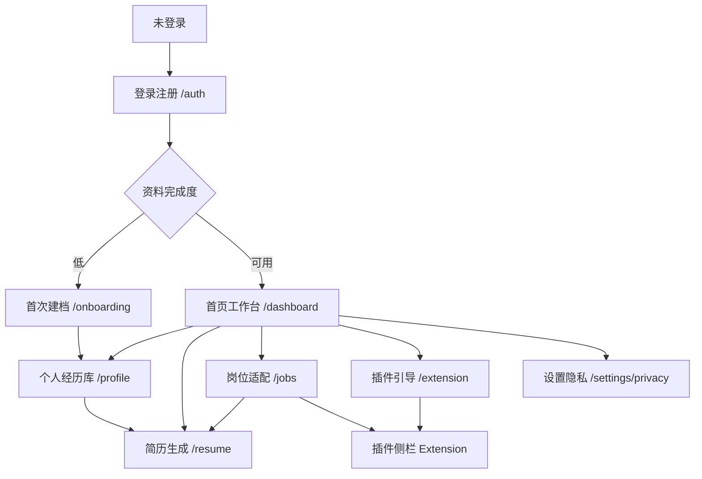

# Beyond CV 前端页面架构与路由总览

## 1. 文档目标

本文档汇总 Beyond CV MVP 的前端页面、路由、模块归属和开发优先级，用于开发排期和设计拆分。具体页面细节见同目录下各 `prdsub-[模块]-[页面].md` 文件。

## 2. 信息架构

## 3. 页面清单

| 页面 | 路由/入口 | 模块 | 优先级 | 文档 |
|-----|-----------|------|--------|------|
| 登录注册 | `/auth` | 账号与安全 | P0 | `prdsub-账号与安全-登录注册.md` |
| 首页工作台 | `/dashboard` | 总控台 | P0 | `prdsub-首页工作台-申请总览.md` |
| 首次建档 | `/onboarding` | 信息采集 | P0 | `prdsub-信息采集-首次建档.md` |
| 个人经历库 | `/profile` | 个人经历库 | P0 | `prdsub-个人经历库-资料管理.md` |
| 简历生成器 | `/resume` | 简历生成 | P0 | `prdsub-简历生成-编辑预览.md` |
| 岗位适配工作台 | `/jobs/new`、`/jobs/:id` | 岗位适配 | P0 | `prdsub-岗位适配-材料生成.md` |
| 插件侧栏 | Chrome Extension | 浏览器插件 | P0 | `prdsub-浏览器插件-字段识别填入.md` |
| 设置与隐私 | `/settings/privacy` | 账号与安全 | P0 | `prdsub-设置隐私-数据控制.md` |
| 插件安装引导 | `/extension` | 浏览器插件 | P0 | `prdsub-插件安装-连接引导.md` |

## 4. 全局导航

### 4.1 Web App 侧边导航

推荐导航项：

1. 工作台
2. 经历库
3. 简历
4. 岗位适配
5. 插件
6. 设置

导航项应使用稳定图标：

- 工作台：LayoutDashboard
- 经历库：UserRound
- 简历：FileText
- 岗位适配：Briefcase
- 插件：Puzzle
- 设置：Settings

### 4.2 全局顶部栏

顶部栏包含：

- 当前页面标题
- 全局保存状态
- 用户菜单
- 插件连接状态

不建议在顶部栏放过多营销入口。

## 5. 全局状态

| 状态 | 使用位置 | 说明 |
|-----|---------|------|
| 未登录 | 全局 | 跳转 `/auth` |
| 首次建档未完成 | 工作台、简历、岗位适配 | 引导补充资料 |
| 资料保存中 | 经历库、简历、岗位适配 | 显示保存状态 |
| AI 生成中 | 建档、岗位适配、简历 | 显示进度，不阻塞其他可操作区域 |
| 插件未连接 | 工作台、插件引导 | 显示连接入口 |
| 敏感字段使用 | 经历库、岗位适配、插件 | 必须提示用户确认 |

## 6. 全局设计原则

- 产品是高频生产工具，不做营销首页式界面。
- 信息密度应高于普通消费 App，但必须保持扫描清晰。
- 每个页面只保留一个主 CTA。
- AI 结果必须可编辑、可确认。
- 敏感信息必须可见、可控、可关闭。
- 页面中不要出现“自动帮你提交”等会造成误解的表述。

## 7. MVP 开发建议顺序

| 阶段 | 页面 | 目标 |
|-----|------|------|
| Sprint 1 | 登录注册、首页工作台、首次建档 | 让用户进入系统并建立资料 |
| Sprint 2 | 个人经历库、简历生成器 | 完成核心资料底座和简历闭环 |
| Sprint 3 | 岗位适配工作台 | 完成 JD 到材料生成闭环 |
| Sprint 4 | 插件引导、插件侧栏 | 完成招聘官网辅助填写闭环 |
| Sprint 5 | 设置隐私、整体打磨 | 完成隐私控制和异常体验 |

## 8. 验收口径

MVP 前端整体验收应满足：

- 用户可以从注册到建档再到生成简历完成闭环。
- 用户可以输入 JD 并保存岗位适配材料。
- 插件侧栏可以展示字段识别、编辑和填入逻辑。
- 敏感字段在所有相关页面都有明确控制。
- 页面之间跳转链路完整，没有孤立页面。

