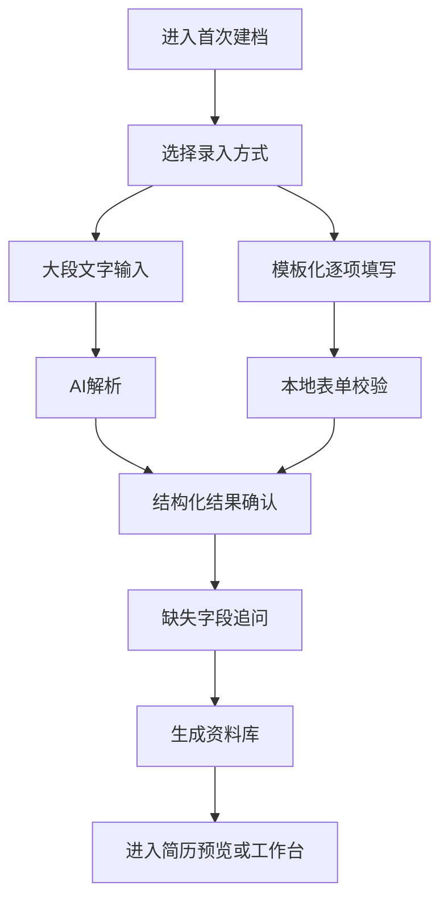

# Beyond CV 页面 PRD：信息采集 - 首次建档

## 1. 页面概述

| 字段 | 内容 |
|-----|------|
| 页面名称 | 首次建档页 |
| 所属模块 | 信息采集 |
| 页面路由 | `/onboarding` |
| 页面优先级 | P0 |
| 主要用户 | 首次使用 Beyond CV 的求职者 |
| 前置依赖 | 用户已登录 |
| 后置页面 | 个人经历库 `/profile`、简历生成器 `/resume` |

首次建档是 Beyond CV 的核心入口，负责把用户散乱的个人经历转为结构化资料库。根据 Lead PRD，P0 必须同时支持“大段文字输入”和“模板化逐项填写”。页面目标不是一次逼用户填完所有内容，而是让用户快速形成可用资料底座，并通过 AI 追问补齐关键缺口。

## 2. 产品目标

- 支持用户用大段文字或模板化表单两种方式录入资料。
- AI 将自然语言解析成教育、实习、校园、技能、家庭信息、开放题素材。
- 用户可逐项确认、编辑、移动分类和保存。
- 系统识别缺失字段并逐个追问。
- 用户可随时保存草稿，后续继续。

## 3. 页面流程

## 4. 页面布局

### 4.1 整体布局

采用分步式页面，不使用长到失控的大表单。

- 顶部：步骤条，显示“选择方式 - 录入资料 - 确认结构 - 补充缺失 - 完成”。
- 左侧：当前步骤主操作区。
- 右侧：资料覆盖率、待补信息、保存状态。
- 底部：上一步、保存草稿、下一步/解析按钮。

### 4.2 录入方式选择

两张并列入口卡片：

- 大段输入：适合已经有简历、经历文字、会议记录或随手写下的经历。
- 模板填写：适合希望按顶级公司通用简历结构逐项录入的用户。

推荐默认引导：

“如果你已经有现成简历或经历记录，先用大段输入；如果你希望从零整理，选择模板填写。”

## 5. 模板化字段结构

模板结构参考 `简历模板/模板1.docx` 与 `简历模板/模板2.docx`。

### 5.1 基础信息

| 字段 | 类型 | 必填 | 说明 |
|-----|------|------|------|
| 中文姓名 | 输入框 | 否 | 中文简历使用 |
| 英文姓名 | 输入框 | 否 | 英文简历使用 |
| 手机号 | 输入框 | 是 | 官网填表高频字段 |
| 邮箱 | 输入框 | 是 | 官网填表高频字段 |
| 地址/城市 | 输入框 | 否 | 可用于英文简历 Physical Address |
| 目标行业 | 多选 | 否 | 金融、咨询、法律、互联网等 |

### 5.2 教育经历

| 字段 | 类型 | 必填 | 说明 |
|-----|------|------|------|
| 学校名称 | 输入框 | 是 | 支持中英文 |
| 学院/院系 | 输入框 | 否 | 如国际金融学院、法学院 |
| 学位 | 下拉/输入 | 是 | 高中、本科、硕士、博士、交换 |
| 专业 | 输入框 | 是 | 支持 Bachelor/Master 表达 |
| 城市/国家 | 输入框 | 否 | 英文简历需要 |
| 开始年月 | 月份选择 | 是 | 国内高校可默认 9 月 |
| 结束年月 | 月份选择 | 是 | 国内高校可默认 6 月 |
| GPA/成绩 | 输入框 | 否 | 敏感字段 |
| 奖学金/荣誉 | 多行输入 | 否 | 可多条 |
| 相关课程 | 多行输入 | 否 | 英文简历 Relevant Coursework |

### 5.3 实习经历

| 字段 | 类型 | 必填 | 说明 |
|-----|------|------|------|
| 公司名称 | 输入框 | 是 | 支持中英文 |
| 部门/组别 | 输入框 | 否 | 如投资银行部、资本市场部 |
| 职位名称 | 输入框 | 是 | Position Title |
| 地点 | 输入框 | 否 | 城市、国家、远程 |
| 开始年月 | 月份选择 | 是 |  |
| 结束年月 | 月份选择 | 是 | 可选“至今” |
| 摘要句 | 多行输入 | 否 | Summary sentence |
| 项目/交易经验 | 子表单 | 否 | 支持 Project #1/#2/#3 |
| Bullet | 多行输入 | 是 | 至少一条 |

### 5.4 校园与领导力经历

| 字段 | 类型 | 必填 | 说明 |
|-----|------|------|------|
| 组织/活动名称 | 输入框 | 是 | 社团、比赛、刊物、公益 |
| 角色 | 输入框 | 是 | 队长、主编、学生大使等 |
| 时间 | 日期/月 | 否 |  |
| 地点 | 输入框 | 否 |  |
| 职责与成果 | 多行输入 | 是 | 用于 Leadership Experience |

### 5.5 技能、证书、兴趣

| 字段 | 类型 | 必填 | 说明 |
|-----|------|------|------|
| 语言 | 标签输入 | 否 | Fluent / Conversational |
| 技术技能 | 标签输入 | 否 | Python、SQL、Tableau 等 |
| 数据/金融工具 | 标签输入 | 否 | Wind、Capital IQ 等 |
| 证书与培训 | 标签输入 | 否 | 法考、课程、训练营 |
| 活动 | 标签输入 | 否 | Student Clubs、Volunteer Work |
| 兴趣 | 标签输入 | 否 | 1-2 行，避免过长 |

### 5.6 家庭信息

| 字段 | 类型 | 必填 | 说明 |
|-----|------|------|------|
| 成员姓名 | 输入框 | 否 | 敏感字段 |
| 关系 | 下拉 | 否 | 父亲、母亲等 |
| 工作单位 | 输入框 | 否 | 敏感字段 |
| 职业/职位 | 输入框 | 否 | 招聘官网可能需要 |
| 是否参与生成 | 开关 | 否 | 默认关闭，仅用于填表时提示 |

## 6. 大段输入解析

### 6.1 输入区

| 元素 | 说明 |
|-----|------|
| 大文本框 | 支持粘贴简历、经历叙述、聊天记录式描述 |
| 示例填充 | 可提供短示例，但不替用户生成虚假经历 |
| 解析按钮 | 点击后进入 AI 结构化 |
| 字数提示 | 展示当前字数和建议范围 |

### 6.2 解析结果展示

解析后采用可编辑表格/卡片：

- 每个结构化条目显示分类、标题、时间、关键信息、置信度。
- 用户可修改分类，例如把“比赛经历”从实习移动到校园经历。
- 低置信度字段用提示色标记。
- 所有字段必须用户确认后才写入正式资料库。

## 7. 缺失字段追问

系统追问必须“一次一个问题”，避免用户被问卷淹没。

| 场景 | 追问示例 | 推荐操作 |
|-----|---------|---------|
| 教育经历缺结束时间 | “复旦大学金融硕士预计毕业时间是 2026 年 6 月吗？” | 提供确认/修改 |
| 实习缺成果 | “这段中信证券经历有没有可量化成果或项目产出？” | 提供补充框 |
| 技能缺熟练度 | “Python 更接近基础使用、数据分析，还是工程开发？” | 单选 |
| 家庭信息为空 | “是否需要补充招聘官网可能要求的家庭信息？” | 可跳过 |

## 8. 交互规则

- 用户可在任何步骤点击“保存草稿”。
- 进入下一步前不强制所有字段完整，但必须有基础联系方式和至少一段教育经历。
- AI 解析结果默认不覆盖用户已手动填写字段。
- 敏感字段在进入资料库前必须显示敏感标签。
- 用户跳过家庭信息时，不影响简历生成，但工作台提示官网自动填写覆盖率较低。

## 9. 异常与边界

| 异常场景 | 处理方式 |
|---------|---------|
| AI 解析失败 | 保留原文，提示用户重试或切换模板填写 |
| 输入文本过长 | 分段解析，并在结果中合并重复经历 |
| 重复经历 | 提示合并，不自动删除 |
| 时间冲突 | 标注冲突并允许用户确认 |
| 用户关闭页面 | 自动保存草稿并提示最近保存时间 |

## 10. 验收标准

- 用户可以选择大段输入或模板填写。
- AI 解析结果可编辑、可分类、可确认。
- 模板填写覆盖基础信息、教育、实习、校园、技能、家庭、开放题素材。
- 缺失字段追问一次只问一个关键问题。
- 用户能保存草稿并从工作台继续。

